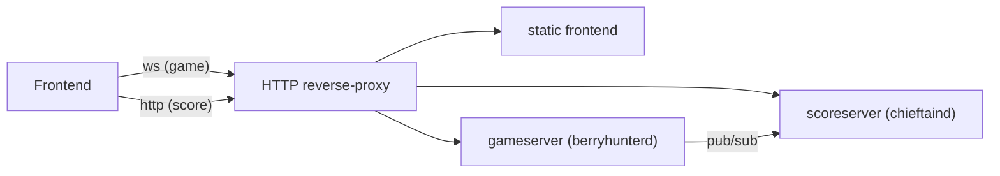

```mermaid

graph LR
    F[Frontend] -- ws (game) --> E[HTTP reverse-proxy]
    F -- http (score) --> E
    E --> CD
    E --> W[static frontend]
    E --> BH["gameserver (berryhunterd)"]
    BH -- pub/sub --> CD["scoreserver (chieftaind)"]
```